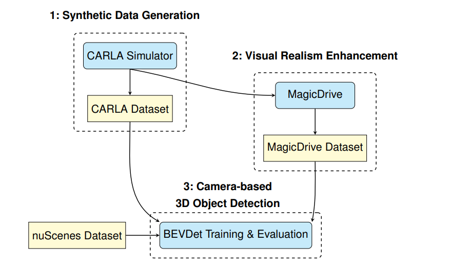
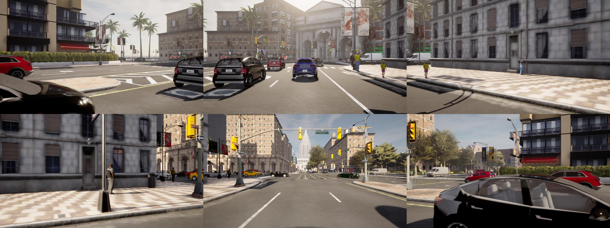
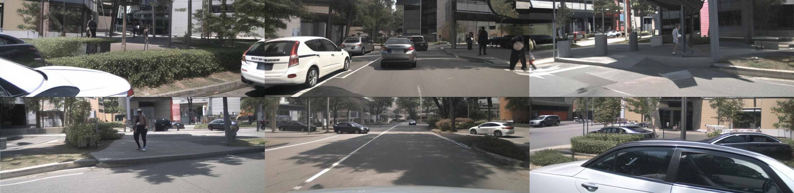
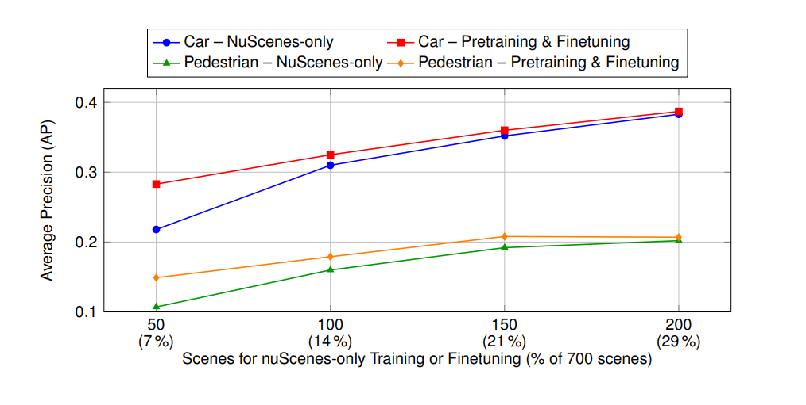

# Enhancing 3D Object Detection with Synthetic Data

Master’s thesis project on using synthetic data to improve camera-only 3D object detection for autonomous driving, combining CARLA, MagicDrive, and BEVDet.

---

## Summary

This work investigates how synthetic data can improve camera-only 3D object detection for autonomous driving.

I:
1. **Generated** a CARLA-based synthetic dataset aligned with the **nuScenes** camera configuration and annotation format.  
2. **Enhanced** the visual realism of the CARLA images using **MagicDrive** to better match real-world appearance.  
3. **Trained and evaluated** BEVDet-R50 models on the **nuScenes** validation set using three strategies: **synthetic-only**, **mixed (MagicDrive + nuScenes)**, and **synthetic pretraining followed by fine-tuning on real data**.  

The **pretraining → fine-tuning** approach achieved the best performance, demonstrating the strong potential of **synthetic data in low-data regimes**, where real data is limited. Experiments focused on the **Car** and **Pedestrian** classes.

---

## Pipeline Overview

*Overview of the main pipeline stages: synthetic data generation in CARLA → visual realism enhancement with MagicDrive → BEVDet training and evaluation on nuScenes.*

---

## Training Setup

- **Model:** BEVDet-R50 (camera-only, 6 views)
- **Input resolution:** 704×256
- **Optimizer:** AdamW  
- **Training schedule:** 24 epochs total
- **Batch / LR:** adjusted for single-GPU training
- **Evaluation:** nuScenes validation set, classes: **Car** and **Pedestrian**
- **Metric:** Average Precision (AP)

All models were trained using the open-source [BEVDet](https://github.com/HuangJunJie2017/BEVDet) framework under the same settings to ensure a fair comparison.

---

## Example Scene Generation and Enhancement

Below is an example 6-camera scene generated in CARLA and its visually enhanced version produced using MagicDrive.

**CARLA (synthetic scene)**  

**MagicDrive (enhanced scene)**  

---

## Key Results

All results are reported on the **nuScenes validation set**, evaluated for the **Car** and **Pedestrian** classes (Average Precision, AP).

| Strategy | Training Data | Epochs | Car AP | Pedestrian AP |
|-----------|----------------|--------|:-------:|:--------------:|
| nuScenes-only | 50 NS | 24 | 0.218 | 0.107 |
| Mixed (MD + NS) | 700 MD + 50 NS | 24 | 0.281 | 0.135 |
| **Pretrain → Finetune** | **700 MD → 50 NS** | **12 + 12** | **0.283** | **0.149** |

*Abbreviations: **NS** = real nuScenes data; **MD** = MagicDrive-enhanced synthetic data. Metric: AP per class on the nuScenes validation split.*

### Effect of Synthetic Pretraining Across Dataset Sizes

*Synthetic pretraining yields the most significant improvements in low-data regimes (50–100 scenes).*

---

## Discussion

These results show that synthetic data can substantially enhance camera-based 3D object detection when real data is limited.  
Aligning the CARLA dataset with nuScenes and improving realism through MagicDrive reduced the domain gap, enabling better generalization to real-world data.  
While performance converges as more real data becomes available, the approach remains valuable for training and adapting perception models when real data is scarce or safety-critical.

---

## References and Resources

- **CARLA Simulator** — https://carla.org  
- **MagicDrive** — https://github.com/cure-lab/MagicDrive  
- **BEVDet** — https://github.com/HuangJunJie2017/BEVDet  
- **nuScenes Dataset** — https://www.nuscenes.org

---

## License

Released under the [MIT License](LICENSE).